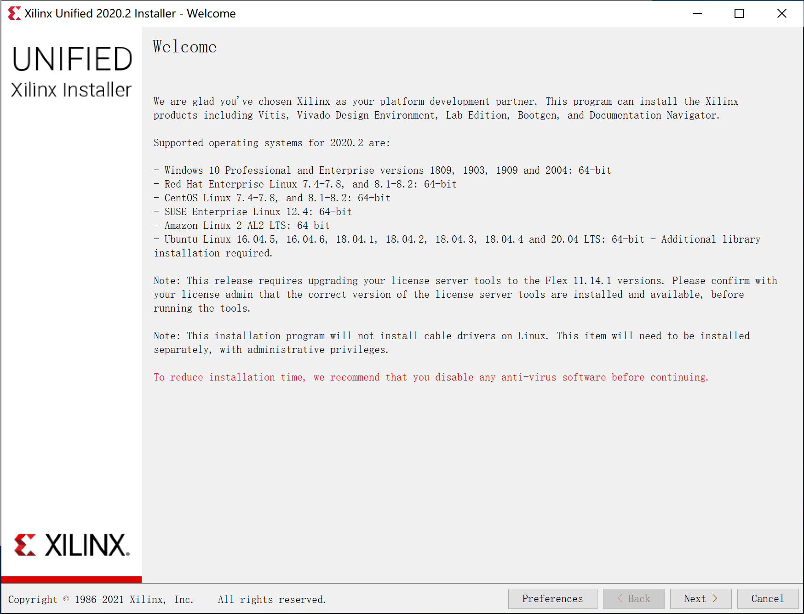
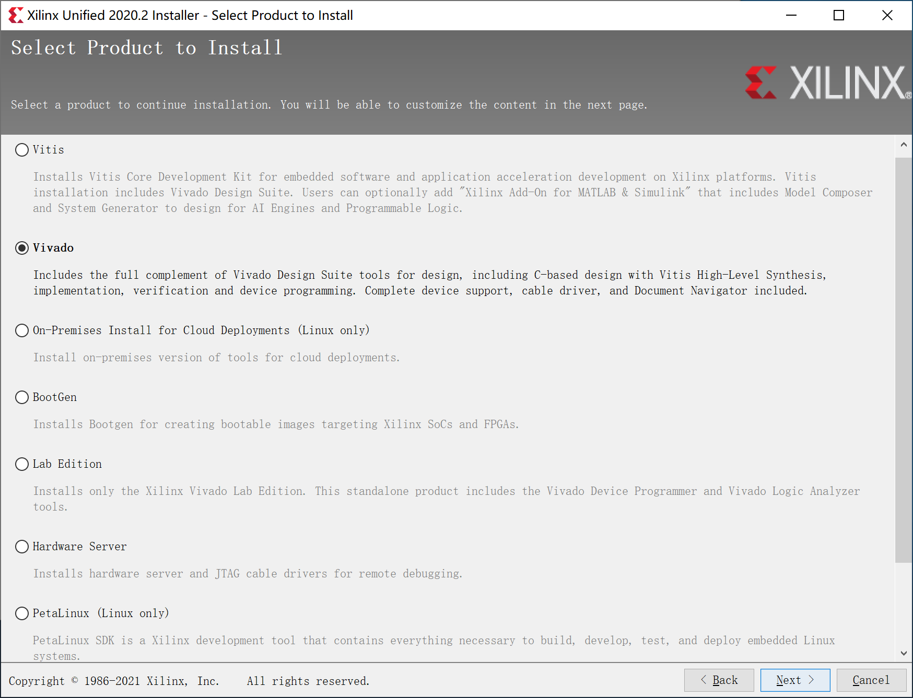
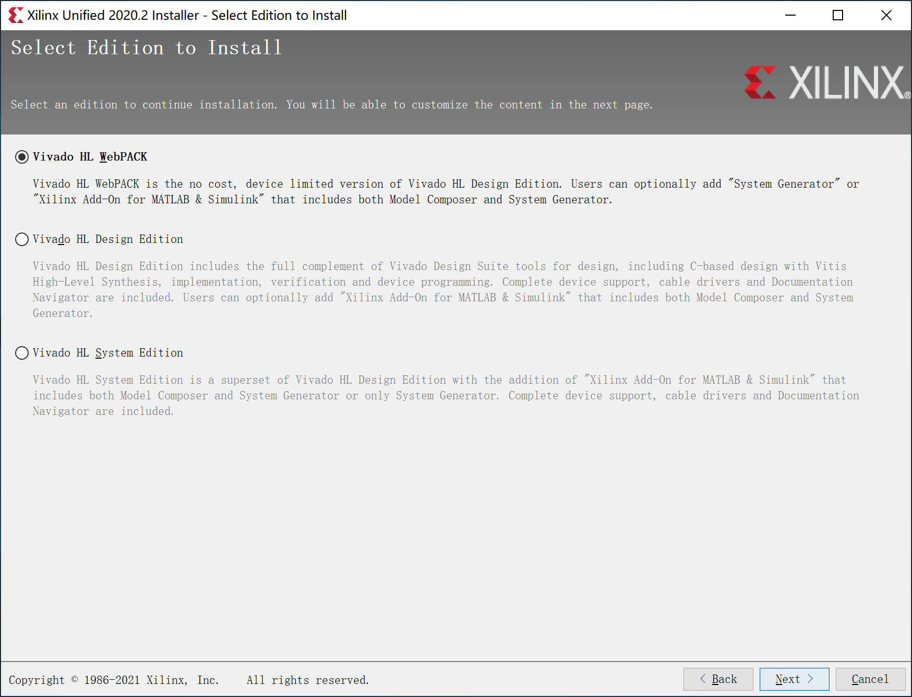
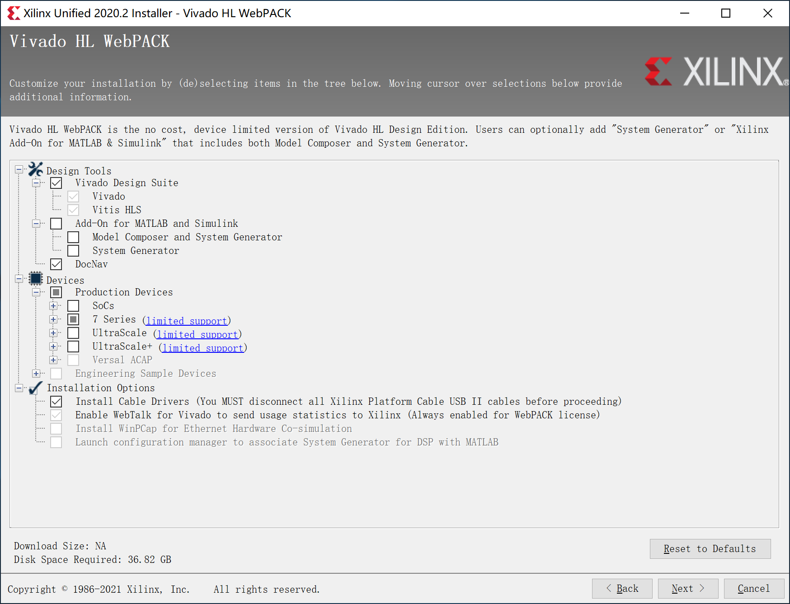

# Vivado HLx 2020.2 简明安装指南

本指南主要针对本课程所需的、基于 Windows 10 的 Vivado 开发环境安装。完整的安装指南请参考：[Xilinx 官方安装指南（中文版）](https://china.xilinx.com/support/documentation/sw_manuals/xilinx2020_2/c_ug973-vivado-release-notes-install-license.pdf)。

## 操作系统

**Xilinx 强烈建议大家检查操作系统的版本号！**

由于 Vivado 是一个专业软件，和 Office 等大众软件不同，Xilinx 公司并没有在所有的环境下测试软件的兼容性。很多运行问题，均是由于操作系统兼容性引起的。

例如：在进行仿真时，出现无法仿真，log 文件显示：“ERROR: [XSIM 43-3410] Failed to compile one of the generated C files.” 错误。[Xilinx 对该问题的官方解决方案](https://forums.xilinx.com/t5/Simulation-and-Verification/ERROR-XSIM-43-3410-Failed-to-compile-one-of-the-generated-C/td-p/713272)就指出：操作系统版本不正确，可能会导致该问题。

Vivado HLx 2020.2 要求的操作系统版本如下：
- Windows 10 Professional/Enterprise version 1809、1903、1909、2004: 64-bit

Vivado 2020.2 需要 Windows 10 Professional 1809 x64 版本。非专业版，或子版本号低于 1809 的，可能会出现未知的问题。

> 由于 Vivado 是专业的工程软件，不像一般软件进行了大量的兼容性测试，因此 Vivado 对安装环境要求比较高。如果安装完毕后运行发生闪退（且没有任何提示），多半是因为和某个软件发生冲突造成的，没有很好的解决方法。建议：在虚拟机中安装 Vivado，来解决闪退的错误。

### 检查 Windows 10 的版本号

- 使用快捷键“Win+r”，打开命令窗口。
- 输入“winver”命令，注意红色框内的版本信息。

## 防病毒软件

**Xilinx 强烈建议关闭防病毒软件！**

由于防病毒软件有时会阻止某些 .bat 文件的运行，阻止修改系统设置，造成 Vivado 安装不完整，导致某些功能不能正常运行，因此**强烈建议：安装前，关闭防病毒软件！**

实测：

- Windows 10 内置的防病毒程序 Defence 无须关闭。
- 360、腾讯电脑管家等，建议关闭。
- Xilinx Unified 2020.2 Installer - Welcome 以红字提示：请关闭防病毒软件。

## 内存需求

Vivado 是一个非常消耗内存的应用程序，FPGA 器件规模越大、设计越复杂，需要的内存越大！

本课程用到的器件是：Artix-7 系列中的 XC7A100T。根据 [Xilinx 对 Vivado 内存配置的官方建议](https://www.xilinx.com/products/design-tools/vivado/memory.html)：对该器件进行设计，所需的空闲内存最小为 2GB，峰值为 3GB。因此，建议在配置了 **8GB** 以上内存的 PC 上安装 Vivado，并保证空闲内存不少于 4GB。

## Product Select

- **Xilinx Unified 2020.2** 包含了 Xilinx 的所有开发工具。我们的课程用到的是 **Vivado**。

- **Xilinx Vivado 2018.2** 只包含 Vivado，没有这一步的选择。

## 选择 Vivado Edition

Vivado HLx 共提供了多个不同的 Edition，供用户按照需求自行选择，各个版本的差异参见官方文档 —— [Vivado Design Suite - HLx 版本](https://china.xilinx.com/products/design-tools/vivado.html#buy)。

本课程的实验不涉及到复杂器件和高级功能，因此 **Vivado HL WebPACK** 版本就足够了，其优点是：

- WebPACK 版本可以对 Artix-7 系列 FPGA 进行全流程的设计和仿真。
- WebPACK 版本是 **free** 的，**无需任何 License**。
- WebPACK 版本安装所需硬盘空间最小。
- 本步骤 2020.2 与 2018.2 相同。

## Vivado HL WebPACK 安装选项

如果希望节省硬盘空间和安装时间，可以使用如下的最小安装选项来完成本课程实验。

- 2020.2 的选项表

- 2018.2 的选项表

