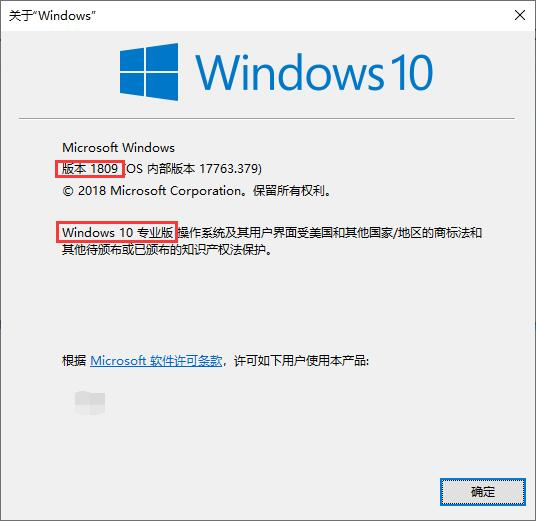
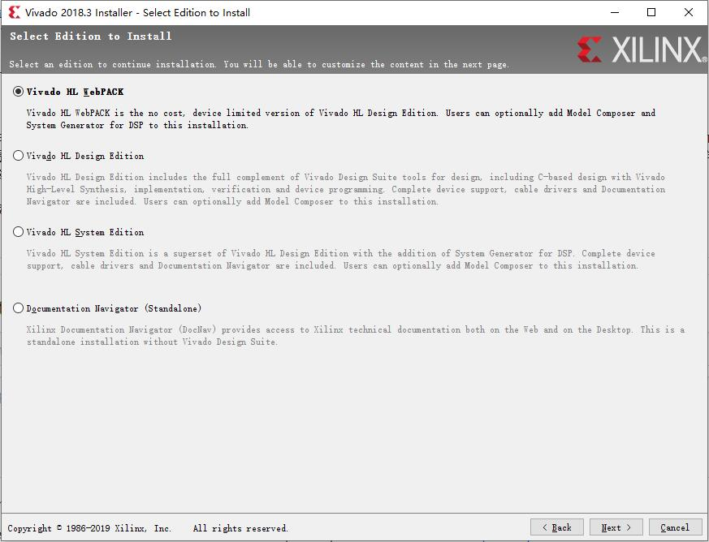
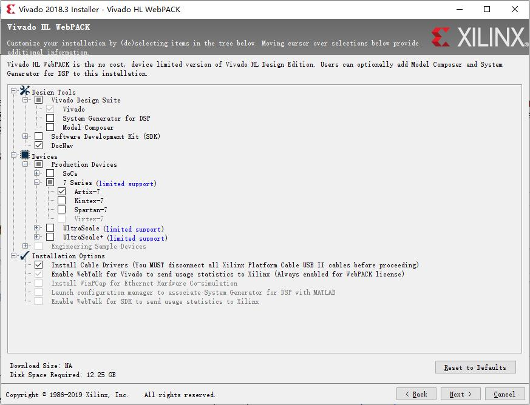

# Vivado HLx 2018.3 简明安装指南

本指南主要针对本课程所需的、基于 Windows 10 的 Vivado 开发环境安装。完整的安装指南请参考：[Xilinx 官方安装指南](https://china.xilinx.com/content/dam/xilinx/support/documentation/sw_manuals/xilinx2018_3/ug973-vivado-release-notes-install-license.pdf)。

## 操作系统

**Xilinx 强烈建议大家检查操作系统的版本号！**

由于 Vivado 是一个专业软件，和 Office 等大众软件不同，Xilinx 公司并没有在所有的环境下测试软件的兼容性。很多运行问题，均是由于操作系统兼容性引起的。

例如：在进行仿真时，出现无法仿真，log 文件显示：“ERROR: [XSIM 43-3410] Failed to compile one of the generated C files.” 错误。[Xilinx 对该问题的官方解决方案](https://forums.xilinx.com/t5/Simulation-and-Verification/ERROR-XSIM-43-3410-Failed-to-compile-one-of-the-generated-C/td-p/713272)就指出：操作系统版本不正确，可能会导致该问题。

Vivado HLx 2018.3 要求的操作系统版本如下：
- Windows 7.1: 64-bit
- Windows 10 Professional version 1803 and 1809: 64-bit
- Red Hat Enterprise Linux 6.6-6.9: 64-bit
- Red Hat Enterprise Linux 7.2-7.5: 64-bit
- CentOS Linux 6.6-6.9: 64-bit
- CentOS Linux 7.2-7.5: 64-bit
- SUSE Enterprise Linux 11.4: 64-bit
- SUSE Enterprise Linux 12.3: 64-bit
- Ubuntu Linux 16.04.4 and 18.04 LTS: 64-bit - Additional library installation required

Vivado 2018.3 需要 Windows 10 Professional 1803 and 1809 x64 版本。非专业版，或子版本号低于 1803 的，可能会出现未知的问题。

### 检查 Windows 10 的版本号

- 使用快捷键“Win+r”，打开命令窗口。
- 输入“winver”命令，注意红色框内的版本信息。

## 内存需求

Vivado 是一个非常消耗内存的应用程序，FPGA 器件规模越大、设计越复杂，需要的内存越大！

本课程用到的器件是：Artix-7 系列中的 XC7A100T。根据 [Xilinx 对 Vivado 内存配置的官方建议](https://www.xilinx.com/products/design-tools/vivado/memory.html)：对该器件进行设计，所需的空闲内存最小为 2GB，峰值为 3GB。因此，建议在配置了 **8GB** 以上内存的 PC 上安装 Vivado，并保证空闲内存不少于 4GB。

## 选择 Vivado Edition

Vivado HLx 共提供了多个不同的 Edition，供用户按照需求自行选择，各个版本的差异参见官方文档 —— [Vivado Design Suite - HLx 版本](https://china.xilinx.com/products/design-tools/vivado.html#buy)。

本课程的实验不涉及到复杂器件和高级功能，因此 **Vivado HL WebPACK** 版本就足够了，其优点是：

- WebPACK 版本可以对 Artix-7 系列 FPGA 进行全流程的设计和仿真。
- WebPACK 版本是 **free** 的，**无需任何 License**。
- WebPACK 版本安装所需硬盘空间最小。

## Vivado HL WebPACK 安装选项

Vivado HL WebPACK 的缺省安装选项约需要 24.45GB 硬盘空间，如果希望更加节省硬盘空间和安装时间，可以使用如下的最小安装选项来完成本课程实验。

